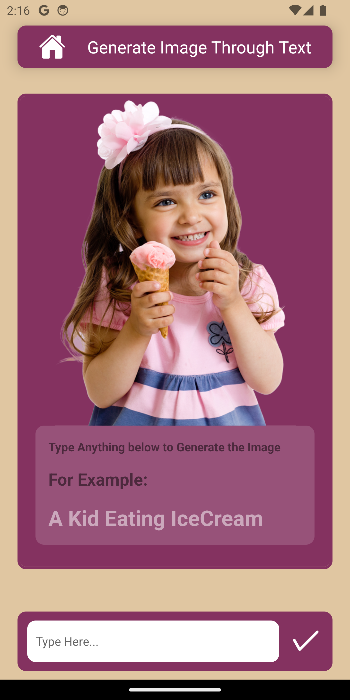
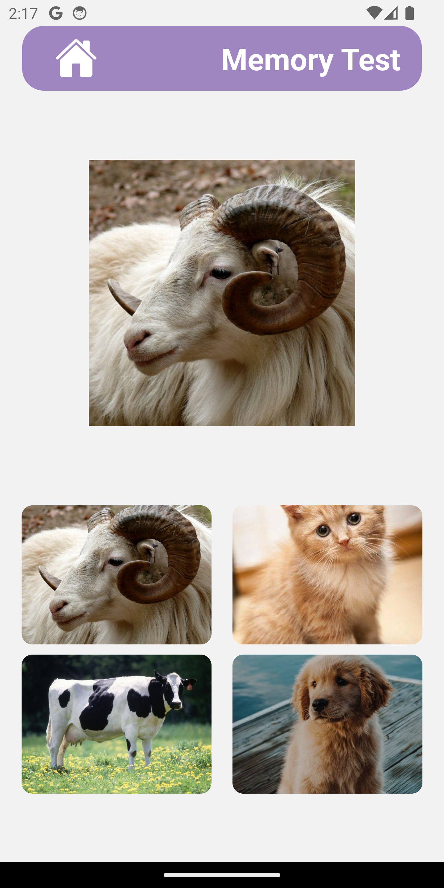
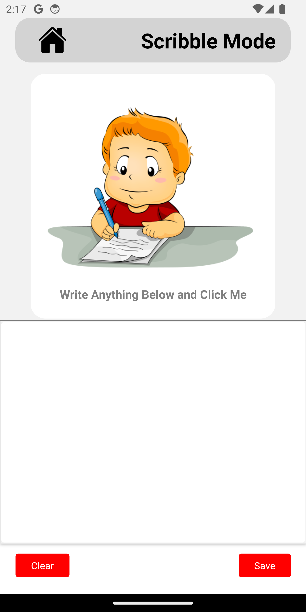
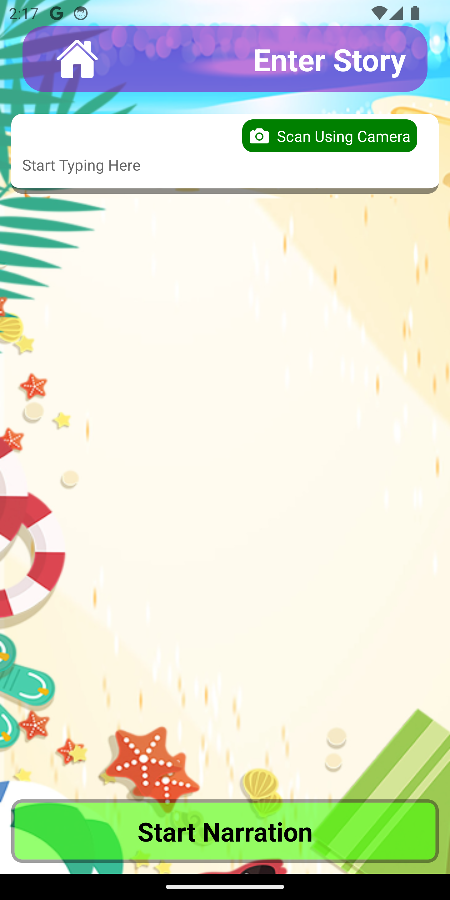

# GudRead - Autism Assist

GudRead is an assistive application designed to help children with autism spectrum disorder (ASD) in their learning and development. The app provides various features to improve visual understanding, memory, and storytelling skills.

## Features

### Handwriting to Image AI

This feature utilizes AI technology to convert handwritten text or drawings into images, helping children visualize what they are learning. It can be particularly useful for those who struggle with abstract concepts or have difficulty understanding written text.

### Memory Game

The memory game is a fun and interactive way to improve memory and concentration skills. Children can match pairs of cards, each displaying an image or symbol, to enhance their visual memory and cognitive abilities.

### Scribble Pad

The scribble pad allows children to freely draw or write on a digital canvas. Their creations can then be converted into images using the handwriting to image AI feature, enabling them to visualize their ideas and thoughts.

### Story Visualizer

The story visualizer brings stories to life by converting written text into a series of images. Children can follow along with the story, enhancing their comprehension and engagement through visual representations.

*Note: The images in this README have been resized for better display. The actual images in the app will be larger and more detailed.*

## Technology Stack

GudRead is built using the following technologies:

- **React Native**: A framework for building cross-platform mobile applications using React.
- **Python Flask**: A lightweight web framework for Python, used to develop the backend API for the handwriting to image AI feature.

## Getting Started

To get started with GudRead, follow these steps:

1. Clone the repository: `https://github.com/sucvijay/GudRead-AI-Autism-Assist-using-React-Native-and-Python.git`
2. Install the required dependencies: `npm install`
3. Start the development server: `npm start`
4. Open the app in your browser: `http://localhost:3000`

## Contributing

Contributions are welcome! If you'd like to contribute to GudRead, please follow these steps:

1. Fork the repository
2. Create a new branch: `git checkout -b my-new-feature`
3. Make your changes and commit them: `git commit -am 'Add some feature'`
4. Push to the branch: `git push origin my-new-feature`
5. Submit a pull request

## License

This project is licensed under the [MIT License](LICENSE).

## Contact

For any questions or inquiries, please contact the project maintainers at [your-email@example.com](mailto:your-email@example.com).